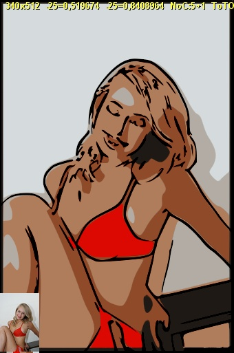



## Convert Pic to Toon

### Description

Converts Images to Cartoon!

this Application uses FreeImage Lib

http://freeimage.sourceforge.net/download.html) for Color Quantization

And POTRACE.EXE for VECTOR GRAPHICS

(http://potrace.sourceforge.net/#downloading) 

----

It's Very very messy (and slow too, so Compile it before Run). But I hope you appreciate the results after trying some parameters. Enjoy.

----

Example Videos here: http://www.youtube.com/user/reexre
 
### More Info
 

             |
---                |---
**Submitted On**   |2009-03-29 20:41:36
**By**             |[reexre](https://github.com/Planet-Source-Code/PSCIndex/blob/master/ByAuthor/reexre.md)
**Level**          |Advanced
**User Rating**    |5.0 (15 globes from 3 users)
**Compatibility**  |VB 6\.0
**Category**       |[Graphics](https://github.com/Planet-Source-Code/PSCIndex/blob/master/ByCategory/graphics__1-46.md)
**World**          |[Visual Basic](https://github.com/Planet-Source-Code/PSCIndex/blob/master/ByWorld/visual-basic.md)
**Archive File**   |[Convert\_Pi2148053292009\.zip](https://github.com/Planet-Source-Code/reexre-convert-pic-to-toon__1-71920/archive/master.zip)

